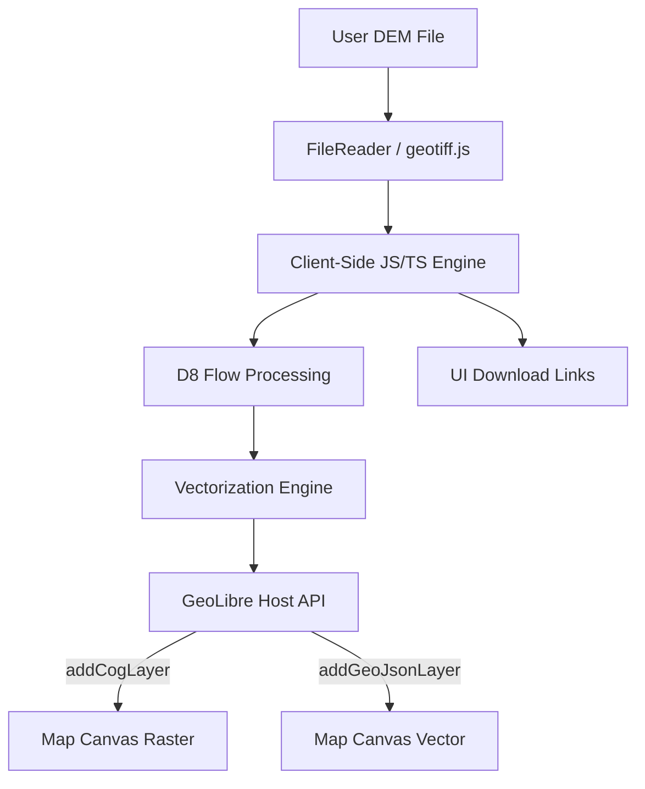
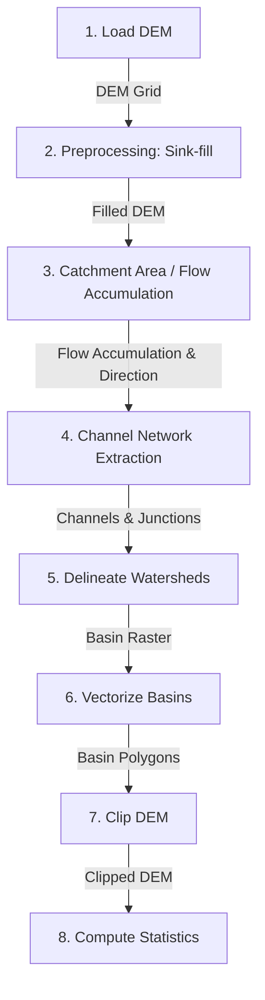

# Technical Specification: Watershed Delineation Plugin

This document outlines the detailed technical implementation specifications for the **GeoLibre Watershed Delineation Plugin**, based on the requirements defined in [Overview.md](file:///c:/Users/erwin/OneDrive/Documents/Learning/Plugin%20Spatio/WatershedDelineation/Docs/Analysis/Overview.md).

---

## 1. Architectural Overview

To ensure compatibility across both **GeoLibre Desktop** (Tauri-based) and the **GeoLibre Web App**, the plugin will be built using a **pure client-side processing architecture**. 

### Rationale:
- **Offline Capability:** Pure client-side execution allows the plugin to function without internet connectivity or a backend server, which is ideal for Tauri/Desktop deployments.
- **Cost and Infrastructure:** Zero backend overhead or hosting requirements.
- **Privacy:** Spatial data is processed entirely locally on the user's machine.



---

## 2. Developer-Controlled Constraints & Size Limits

Since raster operations are memory and CPU intensive, a strict **developer-controlled limit** must be defined to prevent WebView crashes or thread locks.

- `MAX_DEM_PIXELS`: Defined as a constant `const MAX_DEM_PIXELS = 4194304;` (equivalent to a 2048 x 2048 grid, or ~16 MB uncompressed float32 data).
- `MAX_FILE_SIZE_MB`: Defined as `const MAX_FILE_SIZE_MB = 50;` to prevent loading extremely bloated files into memory.

*If an uploaded DEM exceeds these parameters, the plugin will halt processing immediately and display a clear error message in the control panel.*

---

## 3. Data Flow & Step-by-Step Specifications

Below is the structured data flow for the delineation pipeline.



### Step 1: Load the DEM
- **Input:** User-selected local GeoTIFF file.
- **Output:** Structured JavaScript object containing:
  - `width` / `height` (dimensions)
  - `elevationArray` (Float32Array of values)
  - `noDataValue` (number)
  - `geotransform` (Array mapping pixel coordinates to spatial coordinates)
  - `projection` / `crs` (spatial reference details)
- **Validation:** 
  - File size must be `< MAX_FILE_SIZE_MB`.
  - Dimensions `width * height` must be `<= MAX_DEM_PIXELS`.

### Step 2: Preprocessing: Sink-fill the DEM
- **Concept:** Depressions (sinks) in DEMs prevent continuous flow routing. They must be filled to the level of their lowest outlet.
- **Algorithm:** **Wang and Liu (2006)** depression-filling algorithm or a **Planchon & Darboux (2001)** priority queue approach.
- **User Controls / Parameters:** `Z-limit` (maximum depth of sinks to fill; default is unlimited).
- **Input:** `elevationArray`, `noDataValue`, `zLimit`.
- **Output:** `filledElevationArray` (Float32Array).
- **GeoLibre API Integration:** 
  - Encode `filledElevationArray` back into a temporary TIFF blob.
  - Create object URL: `const filledDemUrl = URL.createObjectURL(blob);`
  - Render on map: `app.addCogLayer("Sink-filled DEM", filledDemUrl, { colormap: "terrain", nodata: noDataValue })`
- **Download:** Expose a `.tif` file download (using standard browser link downloading).

### Step 3: Calculate Catchment Area (Flow Accumulation)
- **Concept:** Calculate the flow direction for each cell and trace how many upstream cells drain into it.
- **Algorithm:** 
  - **D8 Flow Direction:** Flow is routed to the steepest downslope neighbor (codes: 1, 2, 4, 8, 16, 32, 64, 128).
  - **Flow Accumulation:** Topologically sort cells based on elevation, then propagate cell counts downstream.
- **User Controls / Parameters:** None.
- **Input:** `filledElevationArray`.
- **Output:** 
  - `flowDirectionArray` (Uint8Array containing D8 codes).
  - `flowAccumulationArray` (Float32Array containing upstream cell counts).
- **GeoLibre API Integration:** 
  - Generate a grayscale or colored GeoTIFF from `flowAccumulationArray`.
  - Render on map: `app.addCogLayer("Flow Accumulation", accumulationUrl, { colormap: "blues", rescaleMin: 0, rescaleMax: maxAccumulation })`
- **Download:** Expose a `.tif` file download.

### Step 4: Extract Channel Network
- **Concept:** Define channels where flow accumulation exceeds a threshold.
- **Algorithm:** Grid traversal of cells where `accumulation >= accumulationThreshold`. Merge adjacent cells into vector line segments. Identify junctions where two channels join.
- **User Controls / Parameters:** `Accumulation Threshold` (integer/slider; minimum cells required to start a stream; e.g., 500 cells).
- **Input:** `flowDirectionArray`, `flowAccumulationArray`, `accumulationThreshold`.
- **Output:** 
  - `channelNetwork` (GeoJSON FeatureCollection of LineStrings).
  - `junctionPoints` (GeoJSON FeatureCollection of Points representing outlet nodes).
- **GeoLibre API Integration:** 
  - Render channels: `app.addGeoJsonLayer("Channel Network", channelNetwork)`
- **Download:** Expose a `.geojson` file download.

### Step 5: Delineate Watersheds
- **Concept:** Delineate sub-basins draining to each channel network junction (outlet point).
- **Algorithm:** Upstream recursive path tracing. Starting from each junction point, trace upstream cells using the `flowDirectionArray` and mark them with the junction's unique `basinId`.
- **User Controls / Parameters:** Optional selection of specific pour points vs automatically using all network junctions.
- **Input:** `flowDirectionArray`, `junctionPoints`.
- **Output:** `basinIdArray` (Int32Array of same dimensions as DEM).
- **GeoLibre API Integration:**
  - Generate a multi-colored categorical GeoTIFF.
  - Render on map: `app.addCogLayer("Subbasins (Raster)", basinRasterUrl, { colormap: "rainbow" })`
- **Download:** Expose a `.tif` file download.

### Step 6: Vectorize Basins
- **Concept:** Convert the categorical subbasin raster into clean polygons for spatial overlay.
- **Algorithm:** Marching squares / cell contour tracing. Trace edges between cells with different basin IDs and construct polygon rings, applying geo-transform offsets.
- **User Controls / Parameters:** None.
- **Input:** `basinIdArray`, `geotransform`.
- **Output:** `basinPolygons` (GeoJSON FeatureCollection of Polygons, with property `basinId`).
- **GeoLibre API Integration:**
  - Render basins: `app.addGeoJsonLayer("Watershed Basins", basinPolygons)`
- **Download:** Expose a `.geojson` file download.

### Step 7: Clip DEM by Subbasin Polygon
- **Concept:** Extract elevation data for a single target subbasin.
- **Algorithm:** Rasterize the chosen subbasin polygon bounding box into a binary mask. Multiply the mask with the `filledElevationArray`, setting out-of-bounds cells to `noDataValue`.
- **User Controls / Parameters:** `Selected Basin ID` (interactive selection from the map or a dropdown list).
- **Input:** `filledElevationArray`, `basinPolygons`, `selectedBasinId`.
- **Output:** `clippedElevationArray` (Float32Array with masked bounds).
- **GeoLibre API Integration:**
  - Render clipped DEM: `app.addCogLayer("Clipped Basin DEM", clippedDemUrl, { colormap: "terrain" })`
- **Download:** Expose a `.tif` file download.

### Step 8: Compute Statistics
- **Concept:** Report basic elevation metrics within the clipped subbasin.
- **Algorithm:** Perform basic summary statistics calculations ignoring `noDataValue` elements:
  - \( \text{Min} = \min(x_i) \)
  - \( \text{Max} = \max(x_i) \)
  - \( \text{Mean} = \frac{1}{N} \sum_{i=1}^N x_i \)
  - \( \text{StdDev} = \sqrt{\frac{1}{N} \sum_{i=1}^N (x_i - \text{Mean})^2} \)
- **User Controls / Parameters:** None.
- **Input:** `clippedElevationArray`, `noDataValue`.
- **Output:** Structured JSON object: `{ min: number, max: number, mean: number, stdDev: number }`.
- **GeoLibre API Integration:** Display statistical readout in the plugin's right panel UI.
- **Download:** Export JSON or download simple CSV of statistics.

---

## 4. Proposed Libraries & Dependencies

To execute this architecture client-side, the following library integration is proposed:

1. **[geotiff.js](https://github.com/geotiffjs/geotiff.js)** (already standard in GeoLibre): To parse binary headers and pixel values from input GeoTIFFs.
2. **Custom JS/TS D8 Router:** Implement clean, non-blocking asynchronous array iterations. To prevent UI thread freezing during longer operations, wrap computation steps in **Web Workers**.
3. **[canvas-to-blob](https://github.com/eligrey/canvas-to-blob)** (or browser native `HTMLCanvasElement.toBlob()` / custom byte array encoders): For converting numerical arrays to standard TIF file blobs client-side.

---

## 5. UI & Interaction Design

The plugin will utilize the GeoLibre Right Panel API (`app.registerRightPanel`) to display step-by-step progress, parameters, and download actions.

```
+------------------------------------------+
| WATERSHED DELINEATION                    |
+------------------------------------------+
| Input DEM: [Select File...]              |
| (Max limit: 2048 x 2048 pixels)          |
+------------------------------------------+
| 1. Load DEM                   [ Loaded ] |
+------------------------------------------+
| 2. Preprocessing              [ Run ]    |
|    Z-Limit: [ 0.0  ]                     |
|    [Download filled-dem.tif]             |
+------------------------------------------+
| 3. Catchment Area             [ Run ]    |
|    [Download flow-accumulation.tif]      |
+------------------------------------------+
| 4. Channel Network            [ Run ]    |
|    Threshold: ===O=== (500 cells)        |
|    [Download network.geojson]            |
+------------------------------------------+
| 5 & 6. Basin Delineation       [ Run ]    |
|    [Download basins.geojson]             |
+------------------------------------------+
| 7 & 8. Clip & Statistics      [ Run ]    |
|    Target Basin ID: [ 102 ]              |
|    - Min: 120m     - Max: 1540m          |
|    - Mean: 840m    - StdDev: 240m        |
|    [Download statistics.csv]             |
+------------------------------------------+
```

Each step's visibility toggle will dynamically show or hide the corresponding layers on the MapLibre viewport via `registerExternalNativeLayer` and visibility bridges.
